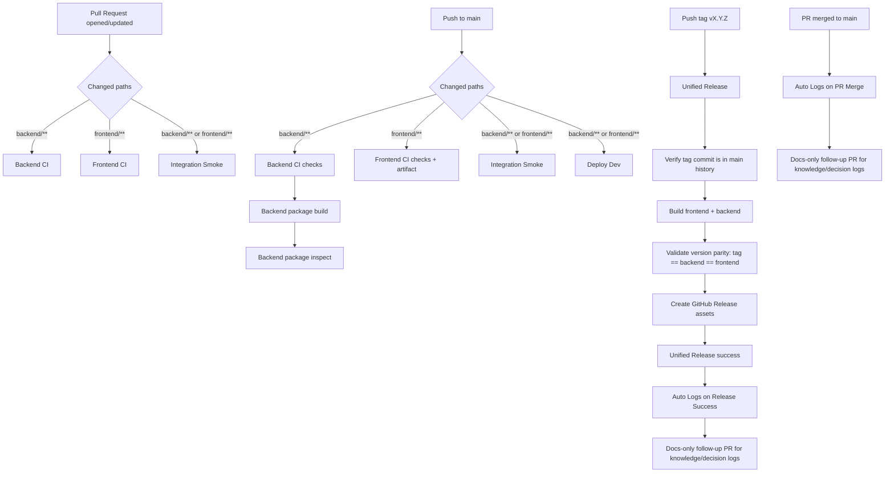
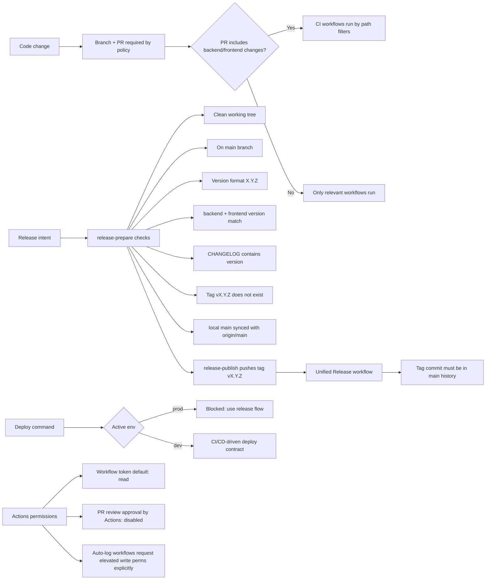

# CI/CD Overview

This page explains how CI and CD work in this repository today.

## 1. Event-to-Pipeline Map

## 2. Pipeline Details

1. `Backend CI` (`.github/workflows/backend-ci.yml`)
   - On PR and push to `main` for `backend/**`.
   - Runs `ruff`, `pytest`, `mypy`.
   - On `main` push, also builds package and runs install+smoke checks from built wheel.

2. `Frontend CI` (`.github/workflows/frontend-ci.yml`)
   - On PR and push to `main` for `frontend/**`.
   - Runs `npm ci`, `npm run lint`, `npm run build`.
   - On `main` push, uploads frontend build artifact.

3. `Integration Smoke` (`.github/workflows/integration-smoke.yml`)
   - On PR and push to `main` when backend or frontend changes.
   - Builds frontend, starts backend, checks `/health` and `/api/frames?source=mock`.

4. `Deploy Dev` (`.github/workflows/deploy-dev.yml`)
   - On push to `main` when backend or frontend changes.
   - Produces frontend/backend artifacts in `dev` environment.
   - Current final step is a deployment simulation gate message.

5. `Unified Release` (`.github/workflows/unified-release.yml`)
   - Triggered only by tag push matching `vX.Y.Z`.
   - Requires tag commit to be reachable from `main`.
   - Builds frontend and backend, checks version parity, publishes GitHub Release.

6. `Auto Logs` workflows
   - `auto-logs-on-pr-merge.yml`: after PR merged to `main`, creates docs follow-up PR.
   - `auto-logs-on-release-success.yml`: after successful `Unified Release`, creates docs follow-up PR.
   - Both update:
     - `docs/agent/knowledge-log.md`
     - `docs/agent/decision-log.md`

## 3. Policy Gates (What Is Enforced)

## 4. Quick Reading Guide

1. For normal feature work: open PR, CI runs by changed paths, merge to `main`.
2. For dev deployment flow: merge to `main` with backend/frontend changes, `Deploy Dev` runs.
3. For production release: run `release-prepare`, then `release-publish`, which triggers `Unified Release` from tag `vX.Y.Z`.
4. After merge/release success: automation opens a docs-only PR with operational logs.

## 5. Repository Settings Snapshot

Current GitHub settings relevant to CI/CD behavior:

- Actions enabled: `true`.
- Allowed actions policy: `all`.
- Default workflow token permission: `read`.
- Workflows cannot approve PR reviews (`can_approve_pull_request_reviews=false`).
- Environments available: `dev`, `prod`.
- Current environment protection rules: none configured (`protection_rules=[]`).
- Branch protection and repository rulesets were not retrievable via API in this plan tier (GitHub returned HTTP 403 for those endpoints).
