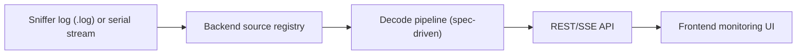

# Modules

Module-level reference documents live here.

## System Flow

## Current Modules

- [backend-api.md](backend-api.md)
- [frontend-app.md](frontend-app.md)

## Documentation Expectations

- Keep each module doc focused on responsibilities, interfaces, dependencies, and limits.
- Update module docs in the same PR when contracts or behavior change.
